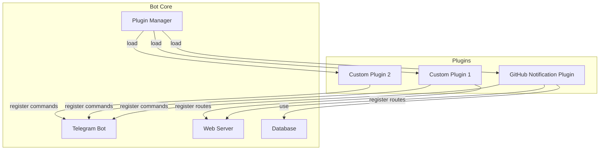

# 插件系统设计文档

## 概述

将 GitHub Bot 的核心功能插件化，允许用户添加自定义插件来扩展 Bot 的功能。

## 插件接口设计

```typescript
interface Plugin {
  // 插件元信息
  name: string;           // 插件名称（唯一标识）
  version: string;        // 插件版本
  description: string;    // 插件描述
  author?: string;        // 作者
  
  // 生命周期钩子
  onLoad?(context: PluginContext): Promise<void>;    // 加载时
  onEnable?(context: PluginContext): Promise<void>;  // 启用时
  onDisable?(context: PluginContext): Promise<void>; // 禁用时
  onUnload?(context: PluginContext): Promise<void>;  // 卸载时
  
  // 功能注册
  commands?: PluginCommand[];         // 注册命令
  routes?: PluginRoute[];             // 注册路由
  webhooks?: PluginWebhookHandler[];  // Webhook 处理器
}

interface PluginContext {
  bot: Bot;                    // Telegram Bot 实例
  app: Hono;                   // Web 服务器实例
  prisma: PrismaClient;        // 数据库客户端
  config: Config;              // 配置对象
  logger: Logger;              // 日志器
}

interface PluginCommand {
  command: string;             // 命令名称
  description: string;         // 命令描述
  handler: CommandHandler;     // 命令处理函数
}

interface PluginRoute {
  method: 'GET' | 'POST' | 'PUT' | 'DELETE';
  path: string;
  handler: RouteHandler;
}

interface PluginWebhookHandler {
  event: string;               // 事件类型
  handler: WebhookHandler;     // 处理函数
}
```

## 架构图



## 目录结构

```
src/
├── core/                      # 核心模块
│   ├── plugin-manager.ts      # 插件管理器
│   ├── plugin-interface.ts    # 插件接口定义
│   └── logger.ts              # 日志模块
├── plugins/                   # 插件目录
│   ├── index.ts               # 插件导出
│   └── github/                # GitHub 插件
│       ├── index.ts           # 插件入口
│       ├── commands/          # 命令
│       ├── routes/            # 路由
│       ├── webhooks/          # Webhook 处理
│       └── services/          # 服务
└── index.ts                   # 应用入口
```

## 插件配置

在 `.env` 中配置启用的插件：

```env
# 启用的插件列表（逗号分隔）
ENABLED_PLUGINS=github,custom-plugin
```

## 示例：自定义插件

```typescript
// src/plugins/my-plugin/index.ts
import { Plugin, PluginContext } from '../../core/plugin-interface.js';

export const myPlugin: Plugin = {
  name: 'my-plugin',
  version: '1.0.0',
  description: 'My custom plugin',
  
  async onLoad(context: PluginContext) {
    context.logger.info('My plugin loaded');
  },
  
  commands: [
    {
      command: 'hello',
      description: 'Say hello',
      handler: async (ctx) => {
        await ctx.reply('Hello!');
      },
    },
  ],
  
  routes: [
    {
      method: 'GET',
      path: '/my-plugin/health',
      handler: async (c) => c.json({ status: 'ok' }),
    },
  ],
};
```

## SSL 支持

在 `.env` 中配置 SSL 证书：

```env
# SSL 配置（可选）
SSL_ENABLED=true
SSL_CERT_PATH=/path/to/cert.pem
SSL_KEY_PATH=/path/to/key.pem
```

## 实现计划

1. **添加 SSL 支持**
   - 更新配置模块支持 SSL 配置
   - 修改 Web 服务器支持 HTTPS

2. **实现插件系统**
   - 创建插件接口定义
   - 实现插件管理器
   - 创建日志模块

3. **重构 GitHub 功能为插件**
   - 将现有 GitHub 功能移至 plugins/github 目录
   - 实现 GitHub 插件入口

4. **更新文档**
   - 添加插件开发指南
   - 更新 README
